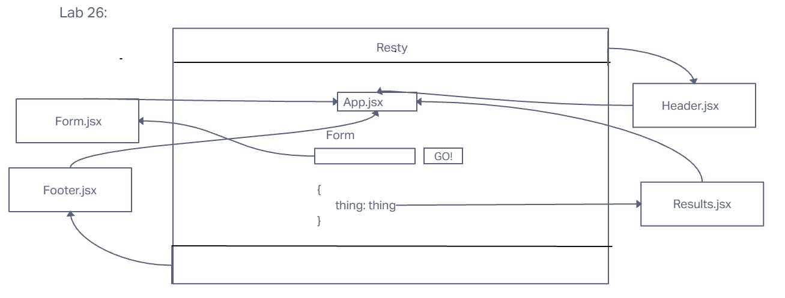
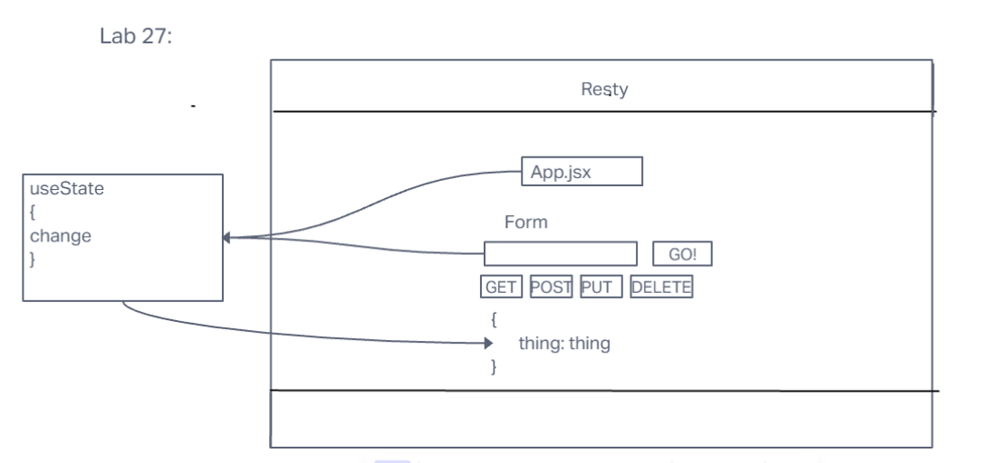
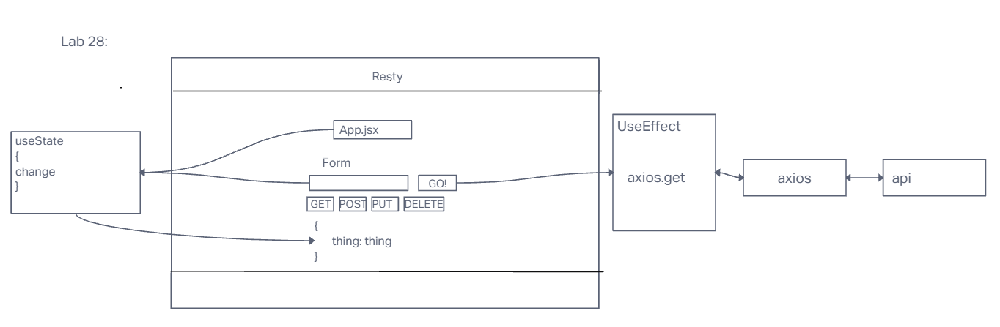

# LAB - Class 26, 27, 28

## Project: Component Based UI

### Author: Emmanuel Gonzales

### Problem Domain  

Create a react app that uses a rest api to make get and post requests to api's.

### Links and Resources

- [GitHub Actions ci/cd](https://github.com/Emmanuel-Gonzales/resty/actions)
- [Lab 27 Deploy](https://codesandbox.io/p/github/Emmanuel-Gonzales/resty/state?workspaceId=7d26a6b1-1665-44a2-a043-5e0f3be0a916 )
- [Lab 28 Deploy](https://codesandbox.io/p/github/Emmanuel-Gonzales/resty/effect-hook?layout=%257B%2522sidebarPanel%2522%253A%2522EXPLORER%2522%252C%2522rootPanelGroup%2522%253A%257B%2522direction%2522%253A%2522horizontal%2522%252C%2522type%2522%253A%2522PANEL_GROUP%2522%252C%2522id%2522%253A%2522ROOT_LAYOUT%2522%252C%2522panels%2522%253A%255B%257B%2522type%2522%253A%2522PANEL_GROUP%2522%252C%2522direction%2522%253A%2522horizontal%2522%252C%2522id%2522%253A%2522EDITOR%2522%252C%2522panels%2522%253A%255B%257B%2522type%2522%253A%2522PANEL%2522%252C%2522panelType%2522%253A%2522TABS%2522%252C%2522id%2522%253A%2522cljmf0psz00gi356nbjn9spb0%2522%257D%255D%252C%2522sizes%2522%253A%255B100%255D%257D%252C%257B%2522type%2522%253A%2522PANEL_GROUP%2522%252C%2522direction%2522%253A%2522horizontal%2522%252C%2522id%2522%253A%2522DEVTOOLS%2522%252C%2522panels%2522%253A%255B%257B%2522type%2522%253A%2522PANEL%2522%252C%2522panelType%2522%253A%2522TABS%2522%252C%2522id%2522%253A%2522cljmf0psz00gk356nts7mjbcp%2522%257D%255D%252C%2522sizes%2522%253A%255B100%255D%257D%255D%252C%2522sizes%2522%253A%255B50%252C50%255D%257D%252C%2522tabbedPanels%2522%253A%257B%2522cljmf0psz00gi356nbjn9spb0%2522%253A%257B%2522tabs%2522%253A%255B%257B%2522id%2522%253A%2522cljmf0psz00gh356nat5lu9t4%2522%252C%2522mode%2522%253A%2522permanent%2522%252C%2522type%2522%253A%2522FILE%2522%252C%2522filepath%2522%253A%2522%252FREADME.md%2522%257D%255D%252C%2522id%2522%253A%2522cljmf0psz00gi356nbjn9spb0%2522%252C%2522activeTabId%2522%253A%2522cljmf0psz00gh356nat5lu9t4%2522%257D%252C%2522cljmf0psz00gk356nts7mjbcp%2522%253A%257B%2522id%2522%253A%2522cljmf0psz00gk356nts7mjbcp%2522%252C%2522activeTabId%2522%253A%2522cljmf10vj00vi356njrhdoyay%2522%252C%2522tabs%2522%253A%255B%257B%2522type%2522%253A%2522TASK_LOG%2522%252C%2522taskId%2522%253A%2522start%2522%252C%2522id%2522%253A%2522cljmf0thv00oo356nbwjks7vv%2522%252C%2522mode%2522%253A%2522permanent%2522%257D%252C%257B%2522type%2522%253A%2522TASK_PORT%2522%252C%2522taskId%2522%253A%2522start%2522%252C%2522port%2522%253A3000%252C%2522id%2522%253A%2522cljmf10vj00vi356njrhdoyay%2522%252C%2522mode%2522%253A%2522permanent%2522%252C%2522path%2522%253A%2522%252F%2522%257D%255D%257D%257D%252C%2522showDevtools%2522%253Atrue%252C%2522showSidebar%2522%253Atrue%252C%2522sidebarPanelSize%2522%253A15%257D)
- [front-end application](https://codesandbox.io/p/github/Emmanuel-Gonzales/resty/main?layout=%257B%2522sidebarPanel%2522%253A%2522EXPLORER%2522%252C%2522rootPanelGroup%2522%253A%257B%2522direction%2522%253A%2522horizontal%2522%252C%2522type%2522%253A%2522PANEL_GROUP%2522%252C%2522id%2522%253A%2522ROOT_LAYOUT%2522%252C%2522panels%2522%253A%255B%257B%2522type%2522%253A%2522PANEL_GROUP%2522%252C%2522direction%2522%253A%2522horizontal%2522%252C%2522id%2522%253A%2522EDITOR%2522%252C%2522panels%2522%253A%255B%257B%2522type%2522%253A%2522PANEL%2522%252C%2522panelType%2522%253A%2522TABS%2522%252C%2522id%2522%253A%2522cljf7bnjp000b356mnv5j4ksa%2522%257D%255D%252C%2522sizes%2522%253A%255B100%255D%257D%252C%257B%2522type%2522%253A%2522PANEL_GROUP%2522%252C%2522direction%2522%253A%2522horizontal%2522%252C%2522id%2522%253A%2522DEVTOOLS%2522%252C%2522panels%2522%253A%255B%257B%2522type%2522%253A%2522PANEL%2522%252C%2522panelType%2522%253A%2522TABS%2522%252C%2522id%2522%253A%2522cljf7bnjp000d356mg24y8fiz%2522%257D%255D%252C%2522sizes%2522%253A%255B100%255D%257D%255D%252C%2522sizes%2522%253A%255B50%252C50%255D%257D%252C%2522tabbedPanels%2522%253A%257B%2522cljf7bnjp000b356mnv5j4ksa%2522%253A%257B%2522id%2522%253A%2522cljf7bnjp000b356mnv5j4ksa%2522%252C%2522activeTabId%2522%253A%2522cljf7bnjo000a356mex0ss4m3%2522%252C%2522tabs%2522%253A%255B%257B%2522id%2522%253A%2522cljf7bnjo000a356mex0ss4m3%2522%252C%2522mode%2522%253A%2522permanent%2522%252C%2522type%2522%253A%2522FILE%2522%252C%2522filepath%2522%253A%2522%252FREADME.md%2522%257D%252C%257B%2522type%2522%253A%2522FILE%2522%252C%2522filepath%2522%253A%2522%252Fpublic%252Ffavicon.ico%2522%252C%2522id%2522%253A%2522cljf7ea7e00m6356mt0f976po%2522%252C%2522mode%2522%253A%2522temporary%2522%257D%255D%257D%252C%2522cljf7bnjp000d356mg24y8fiz%2522%253A%257B%2522id%2522%253A%2522cljf7bnjp000d356mg24y8fiz%2522%252C%2522activeTabId%2522%253A%2522cljf7ckoj00fy356ma2ez00i5%2522%252C%2522tabs%2522%253A%255B%257B%2522type%2522%253A%2522TASK_LOG%2522%252C%2522taskId%2522%253A%2522start%2522%252C%2522id%2522%253A%2522cljf7ceoq00bp356mqpzriyzd%2522%252C%2522mode%2522%253A%2522permanent%2522%257D%252C%257B%2522type%2522%253A%2522TASK_PORT%2522%252C%2522taskId%2522%253A%2522start%2522%252C%2522port%2522%253A3000%252C%2522id%2522%253A%2522cljf7ckoj00fy356ma2ez00i5%2522%252C%2522mode%2522%253A%2522permanent%2522%252C%2522path%2522%253A%2522%252F%2522%257D%255D%257D%257D%252C%2522showDevtools%2522%253Atrue%252C%2522showSidebar%2522%253Atrue%252C%2522sidebarPanelSize%2522%253A15%257D)

### Collaborators

### Setup

#### `.env` requirements (where applicable)

for now I have none and do not require one

#### How to initialize/run your application (where applicable)

- `npm i`
- `npm start`

#### How to use your library (where applicable)

#### Features / Routes

- GET: `api-link`

#### Tests

- `npm test (test-file-name)`

#### UML

